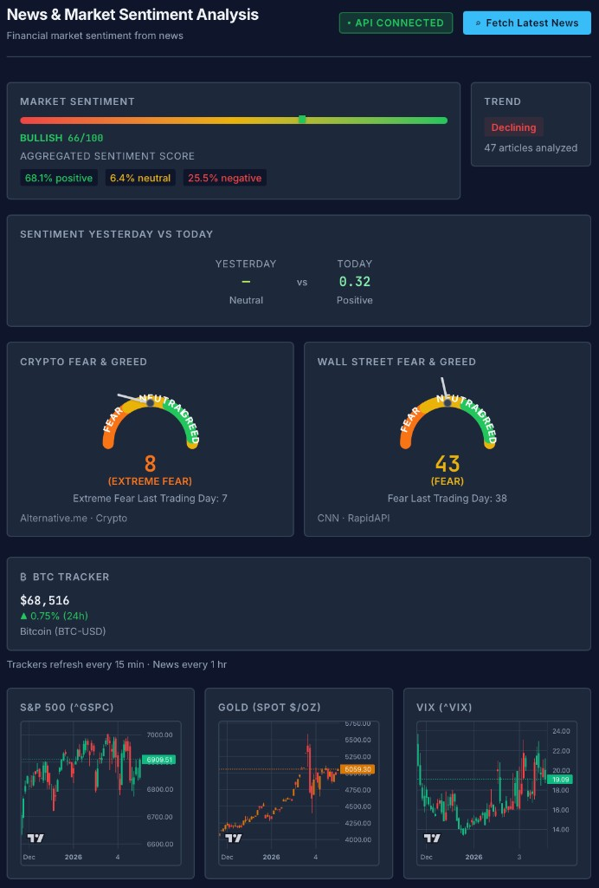

# News & Market Sentiment Analysis

> A full-stack financial intelligence dashboard that aggregates news from major financial outlets, performs real-time NLP sentiment analysis, and visualises live market data across S&P 500, Gold, VIX, and Bitcoin.

[](https://www.python.org/)
[](https://flask.palletsprojects.com/)
[](https://reactjs.org/)
[](https://vitejs.dev/)
[](https://www.docker.com/)
[](LICENSE)
[](https://news-sentiment.imshaon.com/)

**🔗 Live Demo:** [news-sentiment.imshaon.com](https://news-sentiment.imshaon.com/)

---

## Overview

This project bridges financial news aggregation and market sentiment intelligence. It continuously pulls articles from Bloomberg, CNBC, Reuters, Yahoo Finance, and Dow Jones via RSS (no API key required), processes them through a VADER NLP sentiment pipeline, and surfaces actionable signals — bullish, bearish, or neutral — alongside live market charts and a real-time Fear & Greed Index.

Each article is scored on the concatenation of its headline and summary, not the headline alone — improving classification accuracy for terse financial titles. Sentiment history is persisted as a rolling 500-snapshot JSON file, and trend detection uses a half-split algorithm on the most recent 24 snapshots to classify trajectory as improving, declining, or stable.

Built as a full-stack application with a Flask REST API backend and a React 18 / Vite 5 frontend, the system is containerised with Docker and deployed to Render via `render.yaml` blueprint.

---

## Screenshots

| Dashboard |
|-----------|
|  |

---

## Features

- **Zero-dependency news ingestion** — RSS feeds from Bloomberg, CNBC, Reuters, Yahoo Finance, and Dow Jones; no API key required
- **NLP sentiment pipeline** — VADER classification (positive / negative / neutral) with compound scoring on headline + summary concatenation
- **Percentage breakdown** — Per-run positive / negative / neutral article distribution, not just a mean score
- **Trend detection** — Half-split algorithm classifies sentiment trajectory as improving, declining, or stable over the last 24 snapshots
- **Persistent history** — CSV news archive (deduplicated on title + source + URL) and rolling 500-snapshot JSON sentiment history
- **Interactive market charts** — Financial-grade candlestick charts for S&P 500, Gold, and VIX with 90-day OHLC data via lightweight-charts
- **Crypto Fear & Greed** — Live crypto market sentiment via Alternative.me (no API key)
- **Wall Street Fear & Greed** — CNN stock market sentiment via RapidAPI (optional `RAPIDAPI_KEY`)
- **BTC tracker** — Real-time Bitcoin price with 90-day OHLC history
- **Correlation engine** — Same-day and lag-1 Pearson correlation between sentiment time series and S&P 500 daily returns
- **Optional NewsAPI integration** — Expand news sources with a free NewsAPI key; `[Removed]` articles automatically filtered

---

## Tech Stack

| Layer | Technology |
|-------|------------|
| Backend | Python 3.10+, Flask 3.0 |
| NLP | VADER (vaderSentiment) |
| Market Data | yfinance (S&P 500, Gold, VIX, BTC) |
| Crypto Fear & Greed | Alternative.me (stdlib) |
| Wall Street Fear & Greed | RapidAPI (optional) |
| News Ingestion | feedparser (RSS), NewsAPI (optional) |
| Frontend | React 18.3, Vite 5.4 |
| Charts | lightweight-charts 4.2 |
| Containerisation | Docker |
| Deployment | Render (`render.yaml` blueprint) |

---

## Architecture

```
┌──────────────────────────────────────────────────────┐
│                    React Frontend                     │
│   App.jsx → Sp500Chart / GoldChart / VixChart        │
│   Vite 5 build → served by Flask in production       │
└───────────────────────┬──────────────────────────────┘
                        │ HTTP REST
┌───────────────────────▼──────────────────────────────┐
│                   Flask REST API                      │
│                   api/app.py                          │
│   CORS enabled · Cache-Control on market endpoints   │
│   Static file serving with API route guard           │
└───┬──────────────┬────────────────────────────────────┘
    │              │
┌───▼──────┐  ┌────▼──────────────────────────────────┐
│  src/    │  │  External Data Sources                 │
│          │  │  RSS: Bloomberg, CNBC, Reuters,        │
│  news_   │  │       Yahoo Finance, Dow Jones         │
│  extract │  │  Market: yfinance (sequential fetch)  │
│  or.py   │  │  Crypto: Alternative.me Fear & Greed  │
│          │  └───────────────────────────────────────┘
│  sentiment│
│  _analyze │  ┌───────────────────────────────────────┐
│  r.py     │  │  data/                                │
│           │  │  news_archive.csv   (deduplicated)    │
│  sentiment│  │  sentiment_history.json (500 rolling) │
│  _tracker │  └───────────────────────────────────────┘
│  .py      │
│           │
│  market_  │
│  data.py  │
│           │
│  fear_    │
│  greed.py │
└───────────┘
```

---

## Project Structure

```
breaking_news_market_sentiment/
│
├── api/
│   └── app.py                  # Flask REST API — all endpoints, static serving, API route guard
│
├── frontend/
│   ├── src/
│   │   ├── App.jsx             # Main dashboard component & API orchestration
│   │   ├── Sp500Chart.jsx      # S&P 500 candlestick chart (lightweight-charts)
│   │   ├── GoldChart.jsx       # Gold candlestick chart (lightweight-charts)
│   │   └── VixChart.jsx        # VIX volatility chart (lightweight-charts)
│   └── package.json            # React 18.3, Vite 5.4, lightweight-charts 4.2
│
├── src/
│   ├── news_extractor.py       # RSS ingestion; 20 articles/source; summary truncated at 500 chars; dual deduplication
│   ├── sentiment_analyzer.py   # VADER NLP; headline+summary concat; percentage breakdown aggregation
│   ├── sentiment_tracker.py    # CSV archive; JSON history (500-snapshot cap); half-split trend detection
│   ├── market_data.py          # yfinance OHLC; threading lock; MultiIndex handling; Pearson correlation engine
│   └── fear_greed.py           # Alternative.me API via urllib.request; safe int cast; User-Agent header
│
├── main.py                     # CLI pipeline runner (dual-mode: library function + standalone CLI)
├── Dockerfile
├── render.yaml                 # Render deployment blueprint
├── requirements.txt
├── .env.example
└── DEPLOYMENT.md
```

---

## API Reference

### Core endpoints

| Endpoint | Method | Description |
|----------|--------|-------------|
| `/api/health` | GET | Health check — confirms API is running |
| `/api/news` | GET | Latest 100 articles from archive, sorted by publish date |
| `/api/sentiment-summary` | GET | Latest sentiment snapshot with trend signal and percentage breakdown |
| `/api/sentiment-history` | GET | Full sentiment time series for charting |
| `/api/fear-greed` | GET | Live Fear & Greed Index value and classification |
| `/api/markets` | GET | S&P 500, Gold, VIX, and BTC OHLC — fetched sequentially to prevent yfinance data mix-up |
| `/api/pipeline/run` | POST | Trigger fresh ingestion, analysis, and persistence cycle |

### Per-asset endpoints

| Endpoint | Method | Description |
|----------|--------|-------------|
| `/api/markets/sp500` | GET | S&P 500 OHLC only |
| `/api/markets/gold` | GET | Gold OHLC only |
| `/api/markets/vix` | GET | VIX data only |

> All market and fear-greed endpoints return `Cache-Control: no-store, no-cache, must-revalidate` to prevent stale financial data from CDN or browser caching layers.

---

## Quick Start

### Prerequisites

- Python 3.10+
- Node.js 18+
- Git

### 1. Clone the repository

```bash
git clone https://github.com/ShaonINT/breaking_news_market_sentiment.git
cd breaking_news_market_sentiment
```

### 2. Backend setup

```bash
python -m venv venv
source venv/bin/activate        # Windows: venv\Scripts\activate
pip install -r requirements.txt
```

### 3. Frontend setup

```bash
cd frontend
npm install
cd ..
```

### 4. Configure environment (optional)

```bash
cp .env.example .env
# Add NEWSAPI_KEY=your_key_here to enable additional news sources
```

### 5. Run the application

```bash
./start.sh
```

Open **http://localhost:3000** and click **Fetch Latest News** to load and analyse articles.

#### Manual startup (two terminals)

```bash
# Terminal 1 — Flask API
python api/app.py

# Terminal 2 — React dev server
cd frontend && npm run dev
```

#### Production build (single server)

```bash
cd frontend && npm run build && cd ..
python api/app.py
```

Open **http://localhost:5001**

#### Run pipeline from CLI

```bash
python main.py
```

Prints a formatted sentiment report to stdout. Useful for cron scheduling, testing without the web server, or integrating into external workflows.

---

## Deployment

### Render (recommended — one-click)

1. Push your fork to GitHub
2. Go to [Render Dashboard](https://dashboard.render.com) → **New** → **Blueprint**
3. Connect your repository — Render auto-detects `render.yaml`
4. Select **Free** tier → **Apply**

Your app will be live at `https://<your-service>.onrender.com`

### Docker

```bash
docker build -t breaking-news-sentiment .
docker run -p 5001:5001 breaking-news-sentiment
```

For Koyeb, Railway, or VPS deployment, see [DEPLOYMENT.md](DEPLOYMENT.md).

---

## Configuration

| Variable | Required | Description |
|----------|----------|-------------|
| `PORT` | No | Server port (default: `5001`) |
| `NEWSAPI_KEY` | No | Free API key from [newsapi.org](https://newsapi.org) for expanded news coverage |
| `RAPIDAPI_KEY` | No | RapidAPI key for Wall Street (CNN) Fear & Greed Index; subscribe to [Fear & Greed API](https://rapidapi.com/rpi4gx/api/fear-and-greed-index) |
| `FLASK_DEBUG` | No | Set to `true` to enable Flask debug mode |

---

## Key Design Decisions

**Why RSS over a commercial news API?**
RSS is free, zero-dependency, and updates in near-real-time. Every major financial publisher maintains active feeds. No registration or API key required — the system works immediately in any environment.

**Why VADER over FinBERT?**
No GPU, no model download, no inference latency. For a real-time pipeline processing dozens of articles per cycle, the speed trade-off is significant. The modular architecture allows a drop-in NLP engine replacement without changing the API contract or the frontend.

**Why headline + summary concatenation?**
Financial headlines are often terse and ambiguous in isolation ("Fed acts" could be bullish or bearish). Appending the article summary significantly improves classification accuracy without any additional model complexity.

**Why sequential yfinance fetching?**
Concurrent requests to yfinance introduce a caching bug where multiple assets return the same data. The combined `/api/markets` endpoint fetches each asset sequentially — slower, but reliably correct.

**Why `urllib.request` for Fear & Greed?**
Avoids adding `requests` as a dependency for a single API call. The standard library handles it cleanly, keeping the external dependency surface minimal.

---

## Roadmap

- [ ] Upgrade sentiment engine to FinBERT (transformer-based financial NLP)
- [ ] Per-asset sentiment tracking correlated to individual price movements
- [ ] Statistical significance testing on correlation engine (Spearman rank + p-values)
- [ ] WebSocket support for real-time sentiment push updates
- [ ] Alert system — email / Slack notifications on extreme sentiment shifts
- [ ] Sentiment backtesting against historical price data

---

## Contributing

Contributions are welcome. Please open an issue to discuss changes before submitting a pull request.

---

## License

MIT © [Shaon Biswas](https://github.com/ShaonINT)

---

*Built with Python, Flask, React, and a passion for making financial intelligence accessible.*
